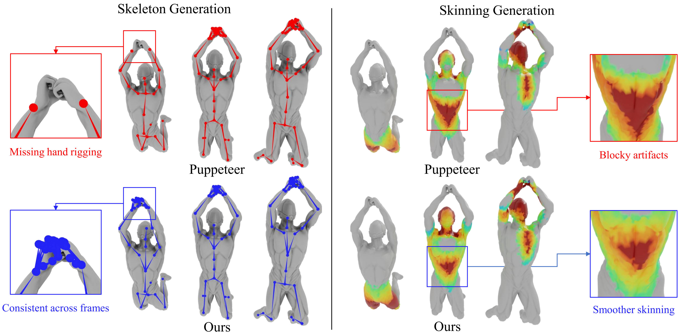

# SPRig: Self-Supervised Pose-Invariant Rigging from Mesh Sequences

<div align="center">

**Ruipeng Wang**<sup>1*</sup> &nbsp; **Langkun Zhong**<sup>2*</sup> &nbsp; **Miaowei Wang**<sup>3</sup>

<sup>1</sup>University of Pennsylvania &nbsp; <sup>2</sup>The University of Hong Kong &nbsp; <sup>3</sup>The University of Edinburgh
<br>
(* Equal contribution)

<a href="https://arxiv.org/abs/2602.12740"></a>
<a href="https://arxiv.org/pdf/2602.12740"></a>
<a href="https://wangruipeng.com/SPRig"></a>

</div>

---

> **TL;DR:** Since an animated sequence represents the same underlying object, we enforce a consistency prior to fine-tune existing rigging models, enabling them to learn robust, pose-invariant rigs from abundant unlabeled data.

<div align="center">
  
</div>

Comparison of our method vs Puppeteer. Our method (top, blue) yields a complete, temporally consistent skeleton with smooth, coherent skinning weights, whereas Puppeteer (bottom, red) produces an incomplete skeleton with missing hand rigging and unstable, blocky skinning.

---

## 🚧 Code Release

This repository is currently under construction. We are organizing the clean version of the training and inference code into the `src/` directory.

Currently, the repository structure is:
- **`doc/`**: Contains the source code for the [Project Page](https://wangruipeng.com/SPRig).
- **`src/`**: (Coming Soon) Will contain the official implementation.

### 🧪 Experimental Code (Colab & Drive)

While we clean up the code, you can access our **experimental notebooks and checkpoints** via the links below. These notebooks were used to run the experiments in the paper on **NVIDIA A100** GPUs.

| Resource | Description | Link |
| :--- | :--- | :--- |
| **Google Colab** | Training & Inference Notebooks | [](https://colab.research.google.com/drive/17BjJ9x97DytsCQ9mxHbmd1nAoOBgQqoL?usp=sharing) |
| **Google Drive** | All Checkpoints & Sample Data | [📂 Open Drive Folder](https://drive.google.com/drive/folders/1x5OpG6EGsQSKDb_2-ZRnmkb7sIl7xNHO?usp=sharing) |

> **Note:** The code in the Colab notebooks is raw and experimental. We are working on merging it into this repository.

---

## 📝 Citation

If you find our work useful for your research, please consider citing:

```bibtex
@misc{wang2026sprig,
      title={SPRig: Self-Supervised Pose-Invariant Rigging from Mesh Sequences}, 
      author={Ruipeng Wang and Langkun Zhong and Miaowei Wang},
      year={2026},
      eprint={2602.12740},
      archivePrefix={arXiv},
      primaryClass={cs.CV},
      url={[https://arxiv.org/abs/2602.12740](https://arxiv.org/abs/2602.12740)}, 
}